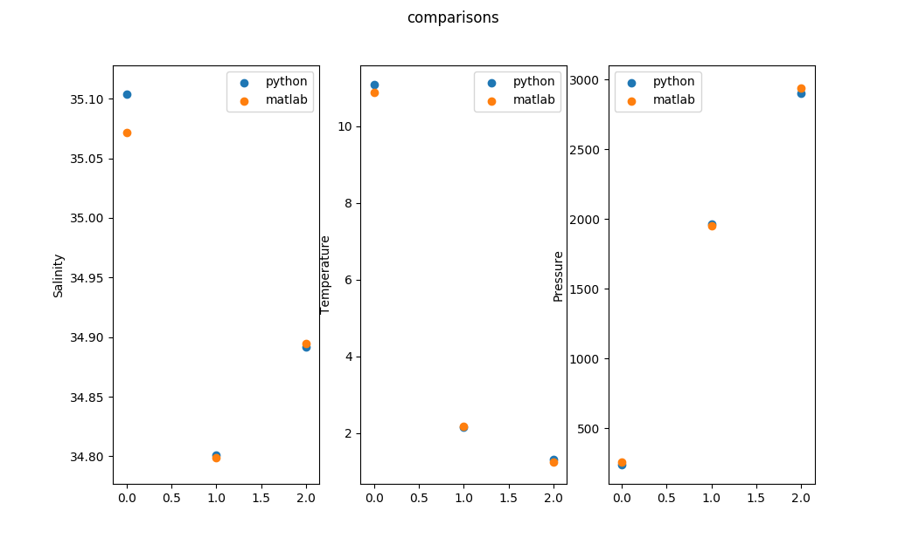

# Pygamma_n

A python port of the gamma_n MATLAB neutral density toolkit using numpy and xarray

## Installation

The easiest way to install this package is to clone it and install it with pip. (When it is fully featured I will upload it to pypi)

In the repository's root

```
pip install -e . --user

```

## Usage

To find neutral density
```
from pygamma_n import gamma_n

gamma,debug = gamma_n.gamma_n(salinities,temperatures,pressures,lons,lats)
```
Salinities, temperatures and pressures should all be vectors of the same length n.
Lons and lats can be vectors of length n, or a single value which is assumed to apply to all salinity, temperature and pressure values given.

To find the water qualities at NS = 27, 27.5 & 28 on a profile:
```

knowns,knownt,knownp = gamma_n.neutralsurfaces(salinities,temperatures,pressures,gamma,[27,27.5,28])c

```

## Comparisons



Here is a comparison between the gamma_n matlab toolkit and this library. It is worth noting that these should not necessarily yield exactly the same results as this library uses TEOS 11

